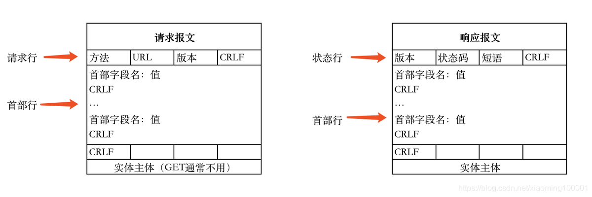
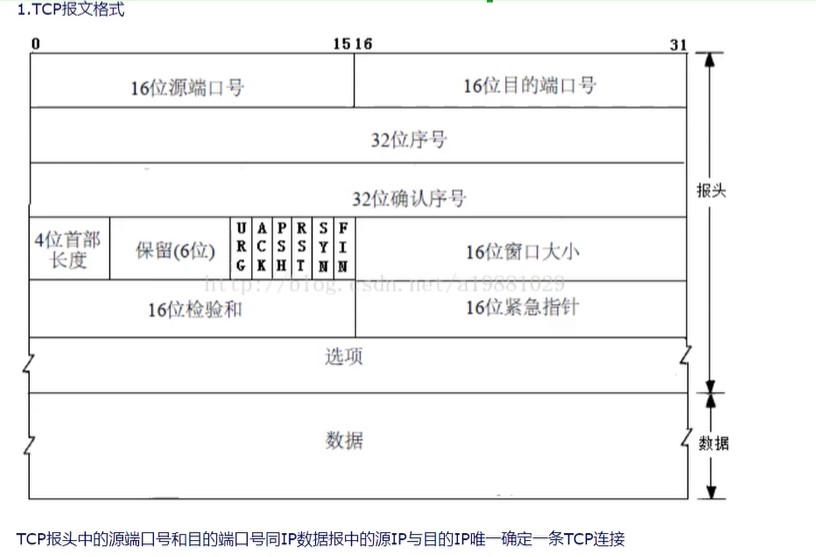

# HTTP

## HTTP 报文格式

## 什么是 HTTP?---明文传输

超文本传输协议，是一个基于请求与响应，无状态的，应用层的协议，常基于 TCP/IP 协议传输数据，互联网上应用最为广泛的一种网络协议,所有的 WWW 文件都必须遵守这个标准。设计 HTTP 的初衷是为了提供一种发布和接收 HTML 页面的方法。

## 什么是 HTTPS？---不是明文传输

《图解 HTTP》这本书中曾提过 HTTPS 是身披 SSL 外壳的 HTTP。HTTPS 是一种通过计算机网络进行安全通信的传输协议，经由 HTTP 进行通信，利用 SSL/TLS 建立全信道，加密数据包。HTTPS 使用的主要目的是提供对网站服务器的身份认证，同时保护交换数据的隐私与完整性。

PS:TLS 是传输层加密协议，前身是 SSL 协议，由网景公司 1995 年发布，有时候两者不区分。

## HTTP 特点

1.无状态：协议对客户端没有状态存储，对事物处理没有“记忆”能力，比如访问一个网站需要反复进行登录操作

2.无连接：HTTP/1.1 之前，由于无状态特点，每次请求需要通过 TCP 三次握手四次挥手，和服务器重新建立连接。比如某个客户机在短时间多次请求同一个资源，服务器并不能区别是否已经响应过用户的请求，所以每次需要重新响应请求，需要耗费不必要的时间和流量。

3.基于请求和响应：基本的特性，由客户端发起请求，服务端响应

4.简单快速、灵活

5.通信使用明文、请求和响应不会对通信方进行确认、无法保护数据的完整性

## HTTPS 有如下特点

1.内容加密：采用混合加密技术，中间者无法直接查看明文内容

2.验证身份：通过证书认证客户端访问的是自己的服务器

3.保护数据完整性：防止传输的内容被中间人冒充或者篡改

## 成本考虑

1.SSL 证书需要购买申请，功能越强大的证书费用越高

2.SSL 证书通常需要绑定 IP，不能在同一 IP 上绑定多个域名，IPv4 资源不可能支撑这个消耗（SSL 有扩展可以部分解决这个问题，但是比较麻烦，而且要求浏览器、操作系统支持，Windows XP 就不支持这个扩展，考虑到 XP 的装机量，这个特性几乎没用）。
根据 ACM CoNEXT 数据显示，使用 HTTPS 协议会使页面的加载时间延长近 50%，增加 10%到 20%的耗电。

3.HTTPS 连接缓存不如 HTTP 高效，流量成本高。

4.HTTPS 连接服务器端资源占用高很多，支持访客多的网站需要投入更大的成本。

5.HTTPS 协议握手阶段比较费时，对网站的响应速度有影响，影响用户体验。比较好的方式是采用分而治之，类似 12306 网站的主页使用 HTTP 协议，有关于用户信息等方面使用 HTTPS。

文章链接https://blog.csdn.net/xiaoming100001/article/details/81109617
视频链接
1.https://www.bilibili.com/video/BV1bi4y1x7m5
2.https://www.bilibili.com/video/BV1qJ411J7Tt