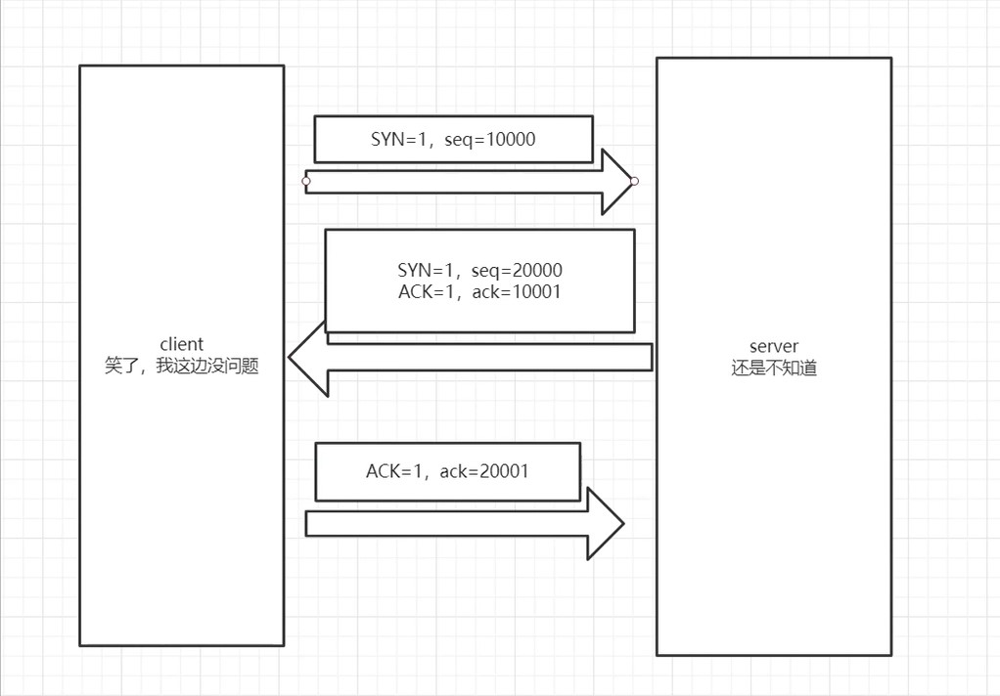

# 三次握手

## 为什么需要三次握手呢？

为了防止已失效的连接请求报文段突然又传送到了服务端，因而产生错误。
三次握手( Three-Way Handshake ）是指建立一个TCP连接时，需要客户端和服务端总共发送3个包以确认连接的建立。

sqe:32位序号
ack:32位确认序号
ACK:确认标志位
SYN:建立连接标志位
FIN:断开连接标志位

## 第一次

第一次握手客户端将标志位SYN置为1，随机产生一个值seq=s，并将该数据包发送给服务端，客户端进入SYN_SENT状态，等待服务端确认。

## 第二次

第二次握手服务端收到数据包后由标志位SYN=1知道客户端请求建立连接，服务端将标志位SYN ACK都置为1，ack=S+1，随机产生一个值 seq=k ,并将该数据包发送给客户端以确认连接请求，服务端进入SYN_RCVD状态。

## 第三次

第三次握手客户端收到确认后，检查ack值是否为s+1，ACK标志位是否为1，如果正确则将标志位ACK置为1，ack=k+1，并将该数据包发送给服务端，服务端检查ack值是否为k+1，ACK标志位是否为1，如果正确则连接建立成功，客户端和服务端进入ESTABLISHED状态，完成三次握手。
建立了状态，完成三次握手。
