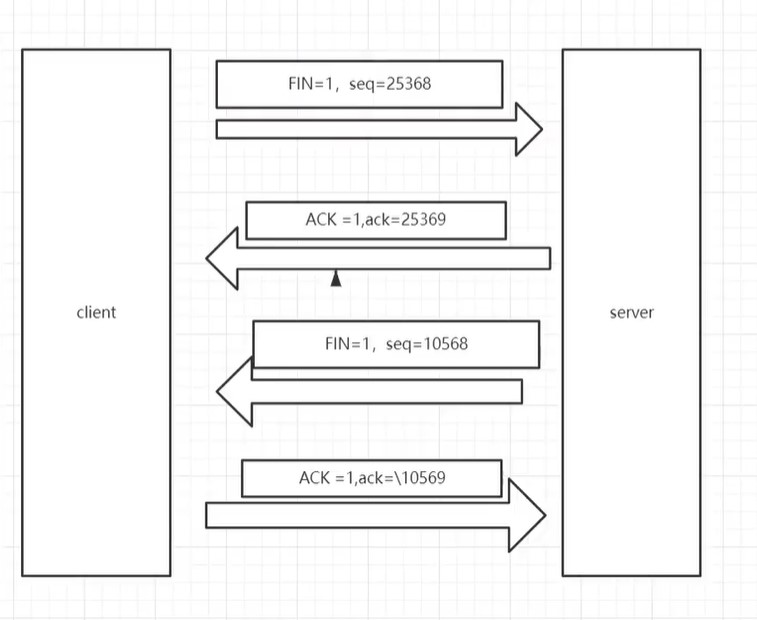

# 四次挥手

## 为什么需要四次挥手呢？

TCP是全双工模式
四次挥手（Four-Way Wavehand )指断开一个TCP连接时，需要客户端和服务端总共发送4个包以确认连接的断开

## 四次挥手流程

第一次挥手客户端发送一个FIN，用来关闭客户端到服务端的数据传送，客户端进入FlN_WAIT_1状态。

第二次挥手服务端收到FIN后，发送一个ACK给客户端，确认序号为收到序号+1，服务端进入CLOSE_WAIT状态。

第三次挥手服务端发送一个FIN，用来关闭服务端到客户端的数据传送，服务端进入LAST_ACK状态。

第四次挥手客户端收到FIN后，客户端进入TIME_WAIT状态，接着发送一个ACK给服务端，确认序号为收到序号+1，服务端进入CLOSED状态，完成四次挥手。
